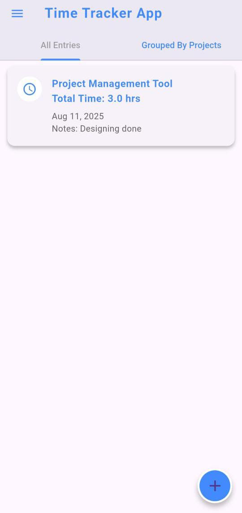

# ⏳ Time Tracking App  

A **Flutter** application to log and manage time entries for different projects.  
This is my **first complete Flutter project** as I begin my journey into mobile app development.  

---

## 📖 Overview  

The **Time Tracking App** helps users log their work hours for various projects, view all entries, and organize them for better productivity.  
Built with **Flutter** and **Provider**, it follows clean code practices and focuses on a simple, intuitive UI.  

---

## ✨ Features  

- ➕ **Add New Time Entry** — Enter project name, date, hours, and notes.  
- 📋 **View All Entries** — See all logged work in one place.  
- 📂 **Group by Project** — Organize time entries based on projects.  
- 🗑 **Swipe to Delete** — Remove entries easily with swipe gestures.  
- 🎨 **Clean UI** — Minimal and beginner-friendly design.  

---

## 🛠 Tech Stack  

- **Flutter** (Dart) — UI & App Logic  
- **Provider** — State Management  
- **intl** — Date Formatting  

---

## 📸 Screenshot  

  

---

## 🖥 Requirements  

Before running this project, make sure you have:  

- **Flutter SDK** (version 3.0 or above recommended)  
- **Dart SDK** (comes with Flutter)  
- **Android Studio** or **VS Code** with Flutter/Dart extensions  
- A connected device or emulator (Android/iOS)  

Check your Flutter installation with:  

```bash
flutter doctor
